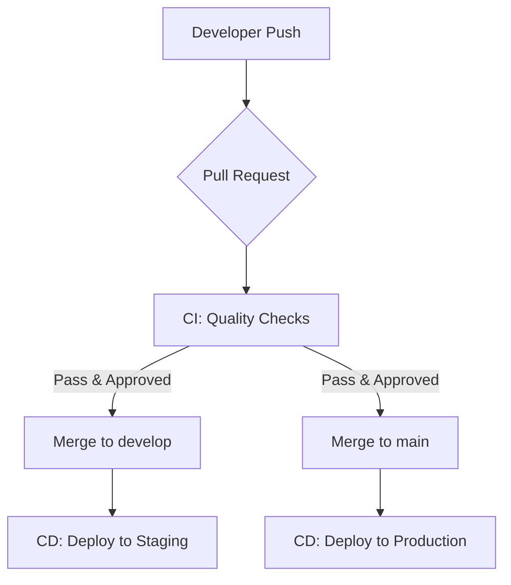

# Git Branching & CI/CD Strategy

This document defines the git branching, environment, and CI/CD strategy for our projects. We follow an **Environment Branching** model (Git Flow) with automated pipelines to manage our deployments to Production and Dev/Staging environments.

## Environments & Pipelines

| Branch    | Environment     | CD Action (Auto-Deploy) | Purpose                                     |
| :-------- | :-------------- | :---------------------- | :------------------------------------------ |
| `main`    | **Production**  | Deploy to Production    | Stable, production-ready code.              |
| `develop` | **Dev/Staging** | Deploy to Staging       | Integration branch for testing and staging. |

---

## 1. Branch Types

### Main Branch (`main`)

- **Protected**: No direct commits allowed.
- **Source of Truth**: Represents what is currently running in Production.
- **Release Source**: Used for tagging production releases (e.g., `v1.0.0`).

### Develop Branch (`develop`)

- **Protected**: Direct commits are discouraged.
- **Integration**: All features and fixes are merged here first for staging.
- **Automatic Deployment**: Merges to `develop` trigger deployments to the **Dev/Staging** environment.

### Feature Branches (`feature/*`)

- **Base Branch**: `develop`
- **Naming**: `feature/<description>` or `cr/<id>-<description>` (aligning with [Change Request](change-request.md) process).
- **Workflow**: Create from `develop`, develop locally, and open a Pull Request (PR) to `develop`.

### Hotfix Branches (`hotfix/*`)

- **Base Branch**: `main`
- **Naming**: `hotfix/<short-description>`
- **Workflow**: Create from `main`, fix the bug, and merge PR into **both** `main` and `develop`.

---

## 2. CI/CD Pipeline

Our pipeline ensures code quality and automated deliveries through two main phases:

### Continuous Integration (CI)

The CI pipeline runs on **every Pull Request** targeting `develop` or `main`.

- **Checks**: Linting, Unit Testing, Build Verification, and Security Scanning.
- **Rules**: A PR cannot be merged until all CI checks pass and it has been reviewed and approved.

### Continuous Deployment (CD)

- **Staging**: Triggered by merges to `develop`. Ensures the latest integration-ready code is available for QA and UAT.
- **Production**: Triggered by merges to `main`. This is the final step in the release process.

---

## 3. The Full Workflow

### Development & Staging

1. Start a new feature or CR branch from `develop`.
2. Push changes and open a PR to `develop`.
3. CI checks run automatically. Once they pass and the PR is approved, it is merged.
4. Code is automatically deployed to **Dev/Staging**.

### Production Release

1. When `develop` is stable and ready for release, open a PR from `develop` into `main`.
2. Review the final diff.
3. Merge the PR. This triggers the **Production** deployment.
4. **Tag** the merge commit on `main` with a version number (e.g., `git tag v1.0.1`).

## Summary of Rules

- **Build Once, Deploy Anywhere**: We use the same build process for all environments.
- **No Direct Commits**: All changes must go through a Pull Request and CI pipeline.
- **Squash and Merge**: Preferred for feature branches to maintain a clean history.

---

## Variation: Single Environment Projects

For smaller projects or internal tools that only utilize a single **Production** environment, we simplify the strategy by removing the `develop` branch.

### Strategy: Pure Trunk Based Development

- **Permanent Branch**: `main` is the only long-lived branch.
- **Environment**: `main` maps directly to **Production**.

### Workflow

1. **Feature/Fix**: Create a short-lived branch (e.g., `feature/*`) from `main`.
2. **CI Check**: Open a Pull Request to `main`. All automated checks must pass.
3. **Merge**: Once approved and checks pass, merge the PR into `main`.
4. **CD Action**: Merging to `main` triggers an automatic deployment to **Production**.

> [!CAUTION]
> In single-environment setups, the risk of production downtime is higher. We strongly recommend adding a **Manual Approval Step** in the CD pipeline before the final deployment is executed.
